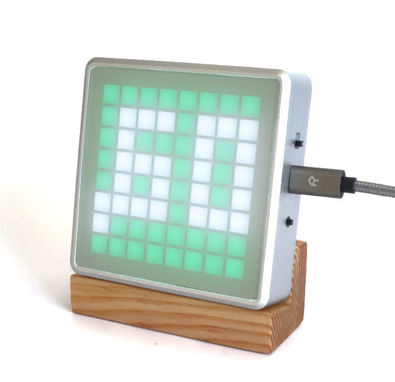
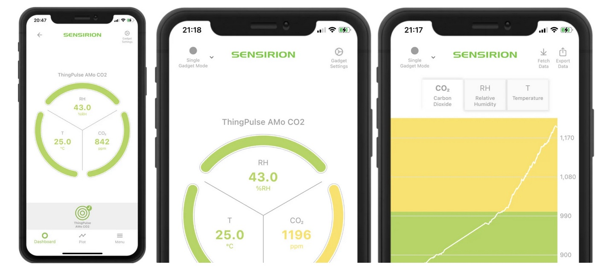
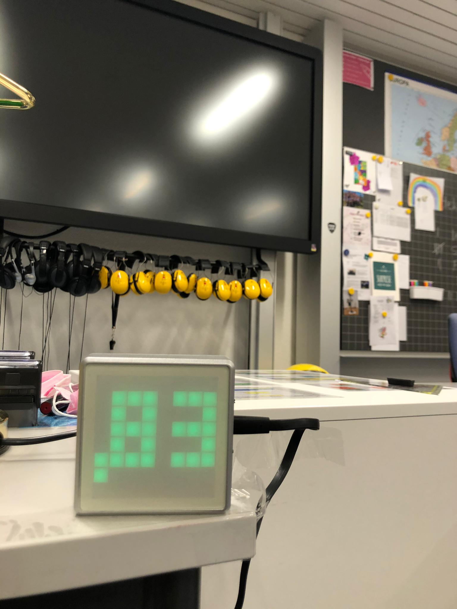
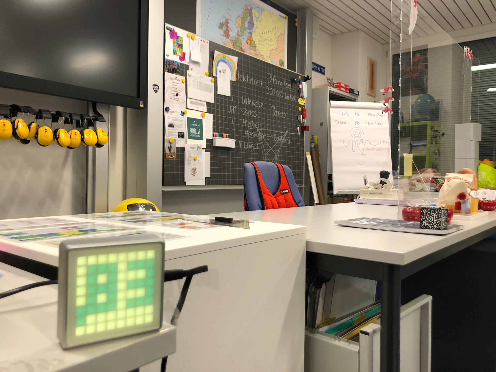

# ThingPulse Icon64/AMo CO2 App

Turn any ESP32-based device into a CO2 monitor with this firmware. Supported CO2 sensors:

- Winsen MH-Z19(C)
- Sensirion SCD4x

The code for both sensors is compiled into the firmware to allow selecting the one you use at runtime.

This is firmware is made for the [ThingPulse Icon64](https://thingpulse.com/product/icon64/) devices of which the [AMo](https://thingpulse.com/product/amo-co2-monitor/) is a specific incarnation.



## Settings

Change the default settings at the top of `main.cpp` to have them compiled into the binary.

```c++
// ********* user settings *********
int co2WarnLevel = 850;     // unit: ppm
int co2AlertLevel = 1000;   // unit: ppm
...
String co2Sensor = "mhz19"; // [mhz19, scd4x]
```
Furthermore, the firmware supports reading all parameters from `/application.properties` on SPIFFS at startup. This allows to install this CO2 app hassle-free without any development environment through the [ThingPulse App Fairy](https://github.com/ThingPulse/app-fairy) (app store).

## Button

Push the button once to turn off accustic warnings. Push it again - after waiting a couple of seconds - to enable them again. This is not a persistent setting. Hence, turning the device off or otherwise cutting the power will activate the default again.

## Mobile App
Version 1.2 and up publish sensor values over BLE to support the Sensirion MyAmbience app available for iOS and Android. Simply turn the device on, open the MyAmbience app and see your device appear on the dashboard.



<p><a href="https://play.google.com/store/apps/details?id=com.sensirion.myam&amp;hl=en_IE"></a><a href="https://apps.apple.com/de/app/sensirion-myambience/id1529131572"></a></p>

## Photos

An Icon64 prototype in classroom use.



